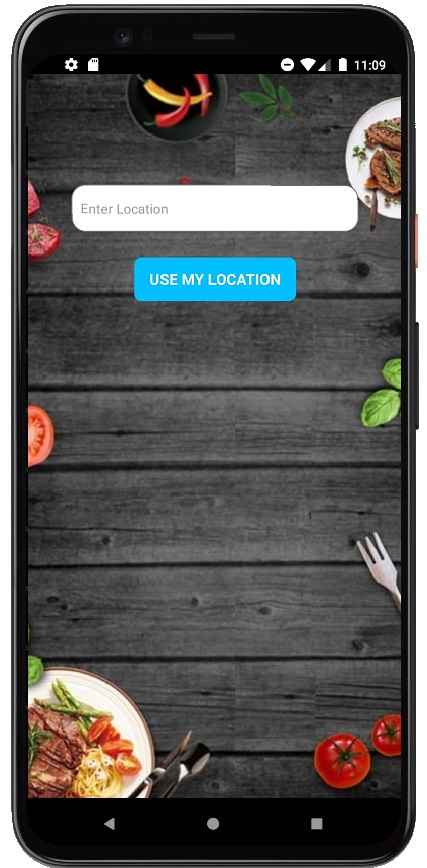
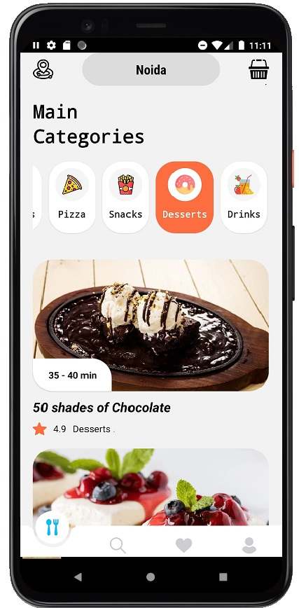
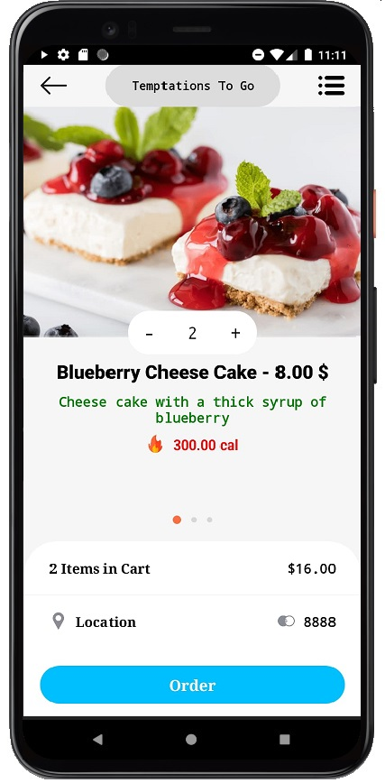
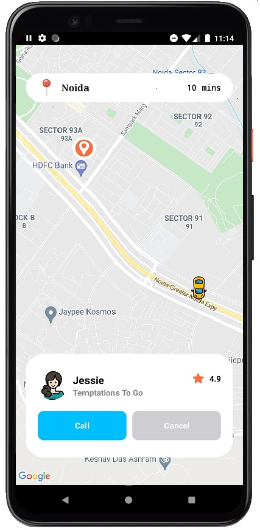

# Food-App

### This is a Food app made using React Native where the user can choose the food type  
### and restaurant accordingly and then the Delivery route is shown using Google Maps

App Screens
-------
| Location Screen   |Home Screen      | 
| ------------- | ---------:|
|      | |

| Order Screen       | Delivery Route Screen          | 
| ------------- | -----:|
|       |  |
